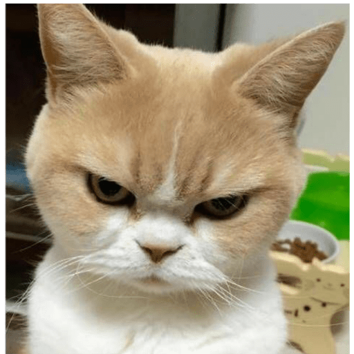

# Meu primeiro repositorio GitHub

### **Quem é meu publico alvo com esse site?** 
Esse site é de forma simples meu portfólio para empresas.

### **Por que o criei?** 
Esse site foi criado para aprimorar meu aprendizado em **HTML** e **CSS**.

### **O que tem no meu site?** 
O site tem todas as minhas infromações pessoais, local onde moro, minha profissão, local de estudo e meus hobbies.

### **Quais as futuras modificações/adições você planeja realizar no meu site?** 
Melhoras na programação, melhoras no design, colocar mais algumas informações sobre mim, fazer com que esse site seja praticamente meu perfil comercial. 